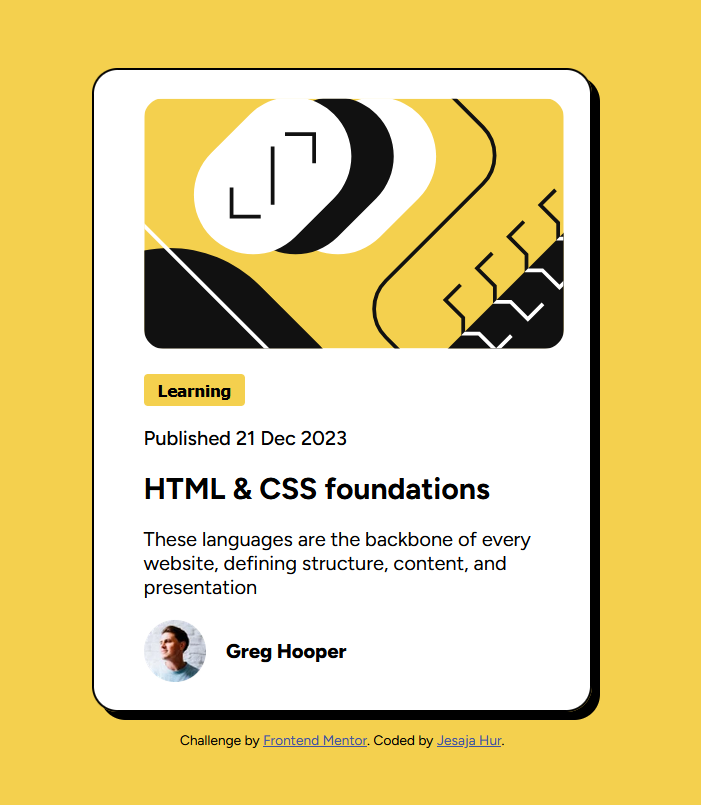

# Frontend Mentor - Blog preview card solution

This is a solution to the [Blog preview card challenge on Frontend Mentor](https://www.frontendmentor.io/challenges/blog-preview-card-ckPaj01IcS). Frontend Mentor challenges help you improve your coding skills by building realistic projects. 

## Table of contents

- [Overview](#overview)
  - [The challenge](#the-challenge)
  - [Screenshot](#screenshot)
  - [Links](#links)
- [My process](#my-process)
  - [Built with](#built-with)
- [Author](#author)

## Overview
### Blog preview card solution

This is a solution to the [Blog preview card challenge on Frontend Mentor](https://www.frontendmentor.io/challenges/blog-preview-card-ckPaj01IcS). Frontend Mentor challenges help you improve your coding skills by building realistic projects. 

### Screenshot

### Links

- Solution URL: https://github.com/Ianu5/Blog-Preview-Card
- Live Site URL: https://ianu5.github.io/Blog-Preview-Card/

## My process

1. Making a list of todos for me to complete the challenge
2. Making a list of tools, methodologies that might come in handy
3. Starting to build from the structure (HTML)
4. Styling the components and adjusting the structure if needed

### Built with

- Semantic HTML5 markup
- Block Element Modifier
- Flexbox
- Mobile-first workflow
